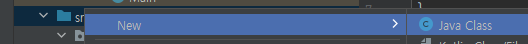

# Learn Java!
> 자바 개인 연습 repo

- 01_Basic
- 02_Method


---

java 파일은 src폴더 하위에 생성

Class 단위로 java 파일을 생성하여 사용




메인 메소드 **public static void main(String[] args)**

자바 어플리케이션이 실행되면 가장먼저 메인메소드가 실행됨


public -> 접근제어자 ( `private` > `protected` > `public`) 순서로 강함

public = 어느곳에서든 해당 객체를 참조할 수 있다는 의미


static = 이 함수는 정적함수다라는 의미

static으로 함수or클래스를 선언했을 경우에 해당 객체는 자바가 컴파일 되는 순간 정의됨

그리고 이후에 static이 아닌 객체가 정의

static 객체에서 static이 아닌 객체를 호출하는 것은 불가능


---

### IntelliJ 단축어&단축키

- main

```java
public static void main(String[] args) {
}
```


- sout
  - System.out.print() : 줄바꿈 x
  - System.out.println() : 줄바꿈 o

```java
System.out.println();
```


- `ctrl` + `d`

```
문장(한 줄) 복사
```


- `ctrl`+`shift`+`/`

```
/* */ 여러 줄 주석처리
```


- for-i

```
for (int i = 0; i < ; i++) {

}
```


- for-each

```
for (:
             ) {
            
        }
```


- `Alt` + 드래그

```
원하는 부분 드래그 가능
```

